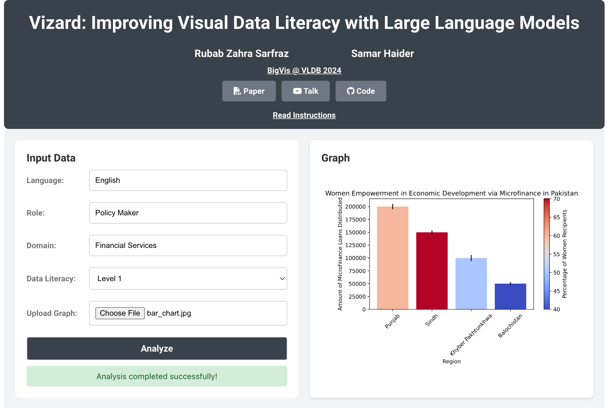

    <a href="https://vizard.info"><b>https://vizard.info</b></a>

**Vizard** is a dashboard companion tool that uses LLMs to analyze data visualizations and make them easy to understand for users of all backgrounds. 

Users can upload an image and have **Vizard** describe the data visualization and the trends observed in it, as well as provide insights and recommendations that are tailored to their industry and occupation in their language of choice. Users can also evaluate their data literacy level using our novel framework which uses procedurally generated questions that are customized according to their interests. We make Vizard open source to encourage more research in this direction.

    

If you're interested in learning more, you can read the **[paper](https://rubabzs.github.io/files/vizard.pdf)** or watch the **[talk](https://www.youtube.com/watch?v=GvphIVJlKgM)**. You can also find all technical details in the **[appendix](https://rubabzs.github.io/files/vizard_appendix.pdf)**.

## Usage

Here is an example of **Vizard** in action. Try it out yourself at **[vizard.info](https://vizard.info/)**!

| Input | Output |
|-------------------------|-------------------------|
|  |  |

## Citation

Please cite the **[Vizard paper](https://rubabzs.github.io/files/vizard.pdf)** (BigVis @ VLDB 2024) if you find it useful in your work:

~~~~
@InProceedings{sarfraz2024vizard,
  title = {Vizard: Improving Visual Data Literacy with Large Language Models},
  author = {Rubab Zahra Sarfraz and Samar Haider},
  booktitle = {VLDB 2024 Workshop: International Workshop on Big Data Visual Exploration and Analytics (BigVis 2024)},
  year = {2024},
  month = {August},
  url = "https://bigvis.imsi.athenarc.gr/bigvis2024/papers/BigVis2024_05.pdf"
  }
~~~~
